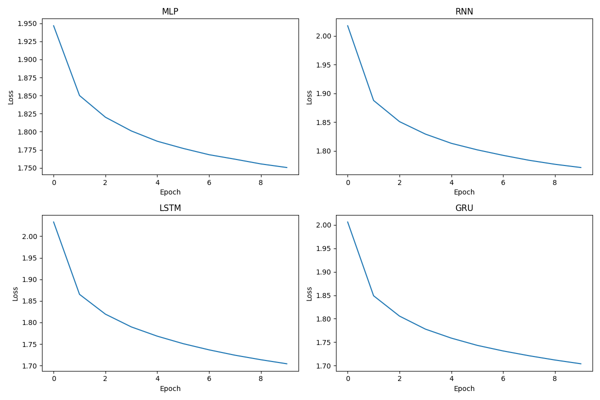
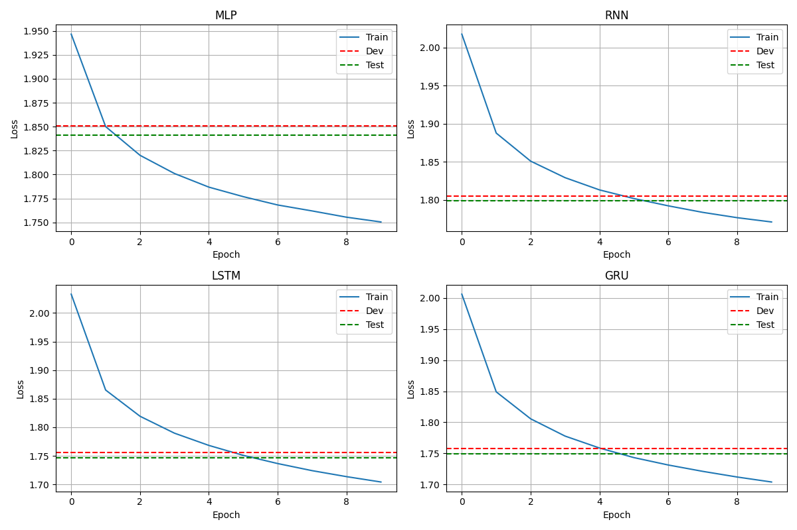

# Language Modelling: Name Generation

## 1. Problem Statement

The goal of this project is to compare multiple deep learning models for character-level language modelling on Indian names. The models are trained to learn naming patterns and generate new names, and the main objective is to evaluate how well each model performs on this task.

## 2. Dataset

The dataset used in this project is [`Training/Indian_Names.txt`](/d:/Projects/Language%20Modelling/Training/Indian_Names.txt), which contains Indian names for training the language models.

The dataset is used to:

- Train the models on character sequences
- Evaluate performance on train, dev, and test splits
- Generate new sample names after training

## 3. Models Used

This project compares the following models:

- `MLP`
- `RNN`
- `LSTM`
- `GRU`

These models are trained and evaluated to determine which architecture performs best for the name generation task.

## 4. Experiments

The experiments were carried out by training each model on the same dataset and comparing their performance using loss and perplexity metrics.

The training workflow includes:

- Training each model on the Indian names dataset
- Evaluating each model on train, dev, and test sets
- Saving trained checkpoints in `Trained_models/`
- Visualizing training and evaluation trends

Run the Streamlit app with:

```bash
pip install -r requirements.txt
streamlit run app.py
```

Training and evaluation code is available in [`Training/Language_Modelling.ipynb`](/d:/Projects/Language%20Modelling/Training/Language_Modelling.ipynb).

### Training Plots

#### Loss vs Epoch



#### Train vs Dev vs Test Loss



## 5. Results

The table below summarizes the performance of each model:

| Model | Train Loss | Train Perplexity | Dev Loss | Dev Perplexity | Test Loss | Test Perplexity |
|---|---:|---:|---:|---:|---:|---:|
| MLP | 1.7504 | 5.7571 | 1.8506 | 6.3634 | 1.8411 | 6.3032 |
| RNN | 1.7712 | 5.8781 | 1.8047 | 6.0784 | 1.7988 | 6.0424 |
| LSTM | 1.7042 | 5.4972 | 1.7559 | 5.7887 | 1.7464 | 5.7339 |
| GRU | 1.7040 | 5.4957 | 1.7581 | 5.8012 | 1.7496 | 5.7524 |

### Sampling Results

The following sample names were generated from the notebook demo in [`Training/Language_Modelling.ipynb`](/d:/Projects/Language%20Modelling/Training/Language_Modelling.ipynb) using `start_char='a'`.

#### MLP

- `anjeena`
- `ayalaksimi`
- `anni`
- `agel`
- `aagizhthi`
- `alata`
- `adeesan`
- `abalashree`
- `akanan`
- `adeeseghitha`

#### RNN

- `anandra`
- `atchithra`
- `amkaran`
- `anan`
- `amaroshini`
- `anthamani`
- `amannoush`
- `anthushali`
- `anthika`
- `anath`

#### LSTM

- `ankBardhini`
- `aAryavan`
- `allishi`
- `aesVanuja`
- `agas`
- `arungaram`
- `avan`
- `arshai`
- `akshiga`
- `amiRaka`

#### GRU

- `avarshini`
- `ahini`
- `aarumani`
- `aAshvi`
- `asenth`
- `andi`
- `aliara`
- `akshana`
- `ahianan`
- `anka`

## 6. Conclusion

The comparison shows that recurrent architectures perform better than the MLP baseline for this language modelling task. Among the evaluated models, `LSTM` and `GRU` achieve the strongest overall results, with lower loss and perplexity values across dev and test sets.

## 7. Future Work

Future work will focus on adding a transformer model and comparing its performance against the current `MLP`, `RNN`, `LSTM`, and `GRU` architectures.
